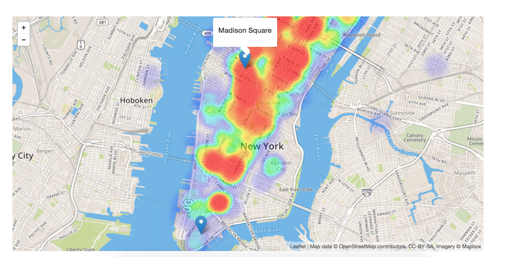

# TIPMAX

## Motivation

My Insight project is to design a web app, named Tip Max, to help (NYC) taxi drivers to maximize their incomes. It can visualize the pick-up locations, like  the profiles of the tip percentage (defined by tips/fare) 
and the total fare that passanges paid over the New York city in the past years. The latter two features are visualized using heatmap, like The Tip Max is able to help taxi drivers to know the best location to increase their income. The web is available at http://tipmaxnyc.xyz.

##Technical Details

The whole project pipeline icnludes two parts: static pipeline and real-time streaming.

### Static Pipeline

For the first part, I fetched the taxi data from the New York city government website, which offered 2009 Jan.-2015 June data. The total amount is about 200GB and there are 13 billions events in the datasets. Also, the data is not ordered in time. So after loading the clean data into the file distributed system HDFS, first we perform the batch processes to group the data by date. The pipeline is as follows 
I chose to use Spark to do the batch process to store the taxi data in the Cassandra database, ordered by time. Cassandra plays a good role to provide high availability in writing. When one wish to visualize the pick-up locations, tips or fare profiles for a certain date and time, the Flask will query data from Cassandra and shows the profile in MapBox (like previous two figures).

### Real-time streaming process 

I also built the real-time streaming pipeline. The NYC does not provide live-streaming data. Based on these reasons, I engineered the real-time streaming data by repeatedly reading a file (which comes from a historial daily data) and prints out the information. In this case we can mock real-time data source. The Python code, tick_kafkaproducer.py, is designed for this function and, meanwhile, it is a Kafka producer. On the other hand, the Spark Streaming is running and plays as a consumer role to fetch the data. The Spark streaming filters out the events based on the current time and the Spark streaming SQL gives top five high-tip locations and averaged (max) tips during the time window.    
